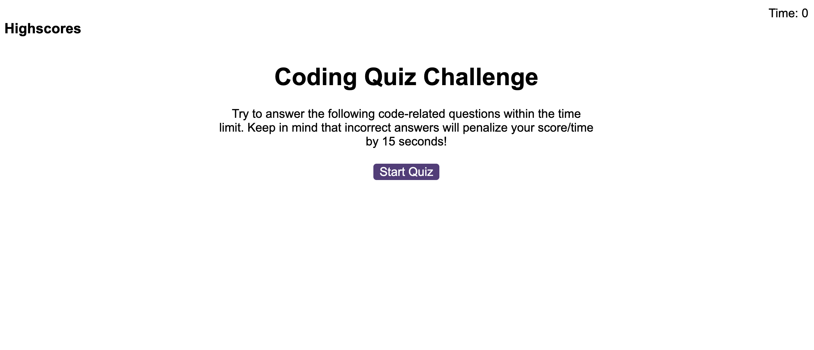
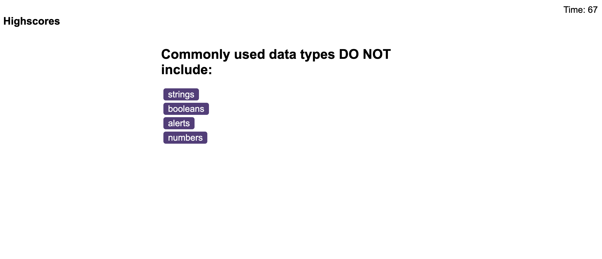
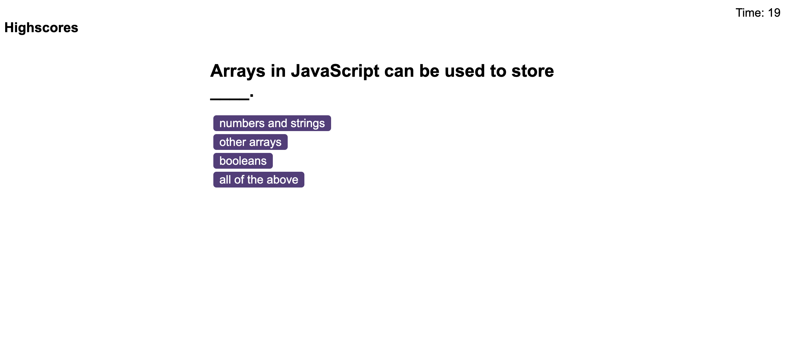
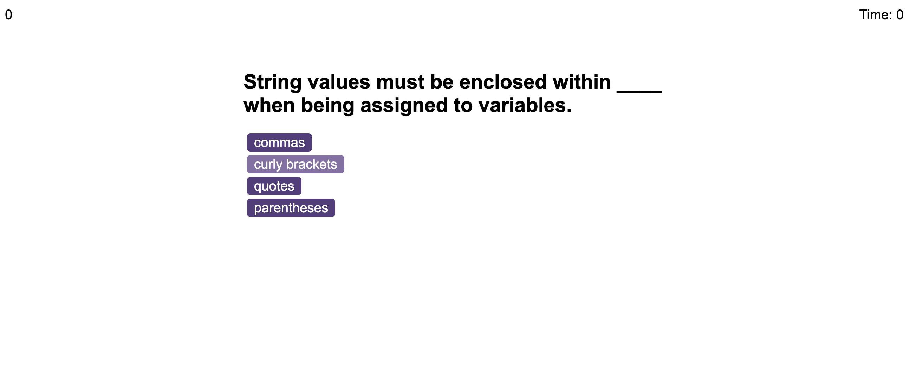
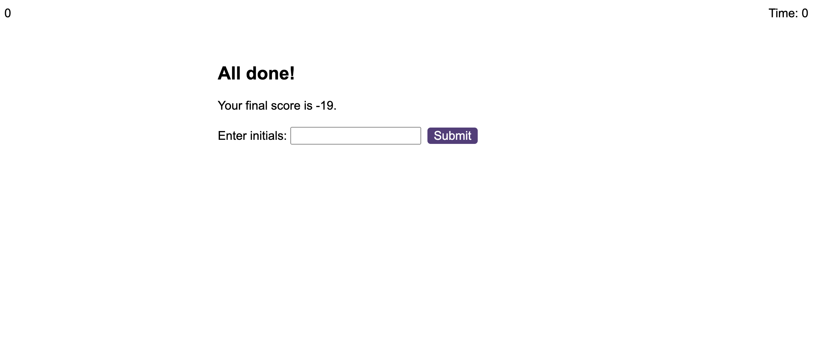

# JSQ
JavaScript Quiz
This was created for the purpose of fulfilling the challenge requirements in module 4. We were to take the starter code (HTML/CSS) and build out the javascript to make the page function to meet the below requirements.

# Description 

```
GIVEN I am taking a code quiz
WHEN I click the start button
THEN a timer starts and I am presented with a question
WHEN I answer a question
THEN I am presented with another question
WHEN I answer a question incorrectly
THEN time is subtracted from the clock
WHEN all questions are answered or the timer reaches 0
THEN the game is over
WHEN the game is over
THEN I can save my initials and my score
```
# Mock-up
The following images show the webpage's apperance









# Links

## End project

https://kylekarotko.github.io/JSQ/

## Github Repo

https://github.com/KyleKarotko/JSQ

